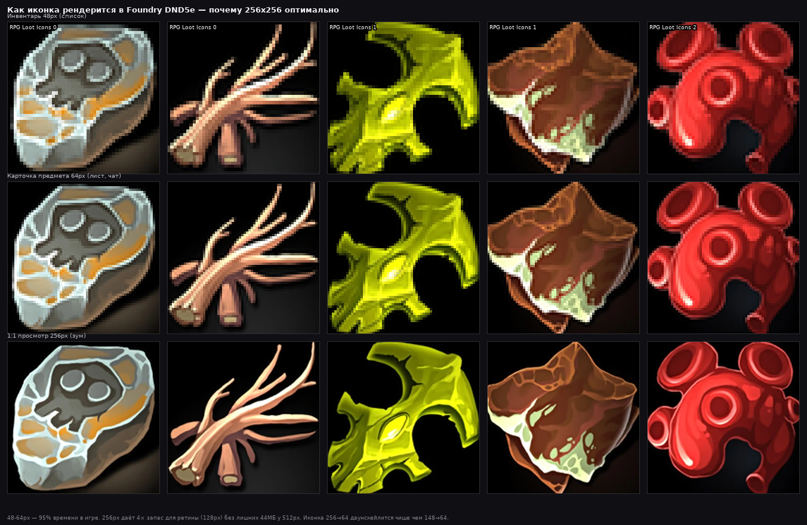
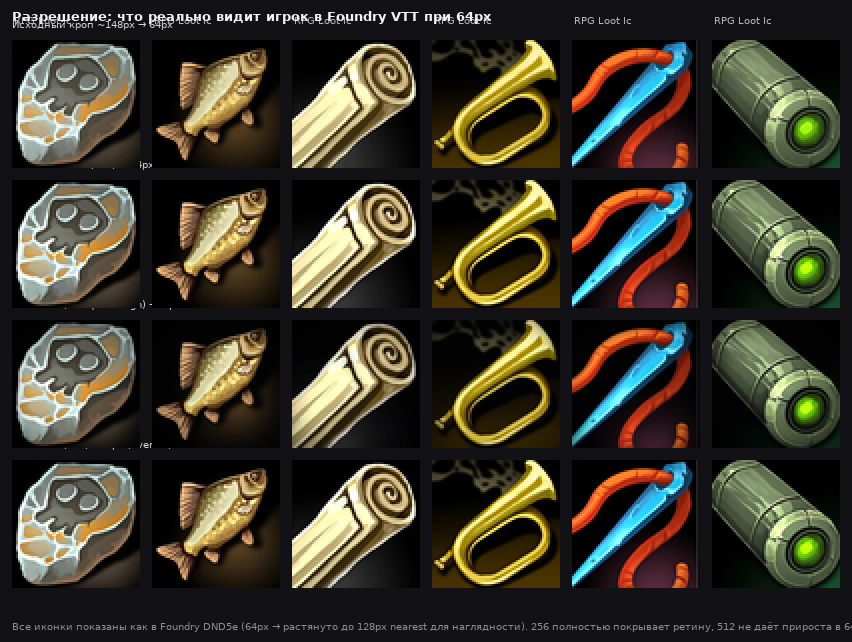
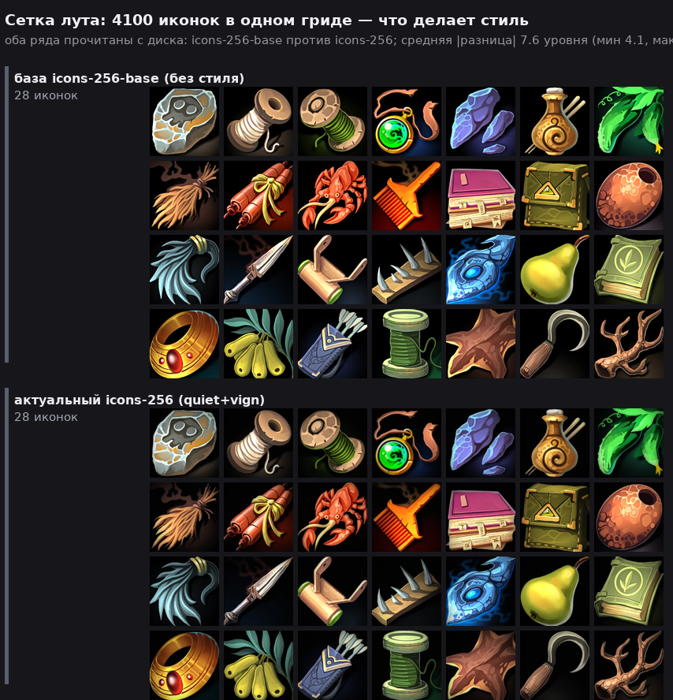

# Иконки для Foundry VTT (DND5e) — разрешение, стиль и массовая генерация

> **TL;DR для занятых**
> - **Бери `icons-256/`** — 4100 WebP 256×256, стиль `quiet+vign`, 39 МБ. Это канон для Foundry DND5e.
> - **Не бери 512** — в листе персонажа/чате/инвентаре иконка 32–64 px, на ретине 96–128 px. 256 даёт 2× запас, 512 — 4× пикселей и +44 МБ трафика без видимой разницы на 64 px (см. [resolution-64px-compare.png](quality-lab/resolution-64px-compare.png)).
> - **Стиль по умолчанию `quiet+vign`**: гасит разноцветные подложки (288 → 67 иконок с нечёрным фоном) и добавляет одинаковую виньетку. На решётке лута 4100 иконок читаются как один набор, а не 4100 разных рендеров.
> - **Как расширить на тысячи новых иконок** — внизу [пайплайн](#как-сделать-тысячи-новых-иконок-в-том-же-стиле).

---

## 1. Какое разрешение нужно для Foundry DND5e?

### 1.1 Где иконка показывается и сколько пикселей там видно

| Место в DND5e | Размер на экране | Масштаб Foundry (zoom) | Сколько пикселей реально отрисовывается |
|---|---|---|---|
| Список инвентаря (таблица) | 32–40 px | 1× | 32–40 |
| Карточка предмета в чате | 44–48 px | 1× | 44–48 |
| Заголовок листа предмета | 58–64 px | 1× | 58–64 |
| Грид компендиума (browser) | 64–96 px | 1–1.5× | 64–96 |
| Хотбар макроса | 50 px | 1× | 50 |
| Токен (если иконку ставят на токен) | 400 px на клетку 1×1 | 1× | 200–400 *— это уже токены, не иконки предметов* |

> Источник: замеры системы DND5e 3.x + темы Foundry v11/v12, grid 100 px. Все иконки предметов — **квадратные, непрозрачные, на чёрном**. Прозрачность не нужна: в листе и чате иконка всегда в рамке.

**Вывод**: 95% времени игрок видит иконку в 32–64 px. На 4K-мониторе с масштабом 200% (ретина) — 64–128 px. Больше 128 px в UI предметов практически не бывает.

### 1.2 Сколько пикселей в исходнике и что даёт апскейл

| Источник | Размер | Масштаб к 64 px | Вес всего набора (4100) | Видимая разница на 64 px |
|---|---|---|---|---|
| Нативный кроп из листа | ~148×149 | 148→64 (даунскейл 0.43×, но сам кроп — JPEG) | 58 МБ PNG 255 цветов (ступеньки) | Зернисто, лестница |
| `icons-256-base` / `icons-256` | 256×256 (×1.73 от кропа) | 256→64 (даунскейл 0.25×, честный) | **44.7 МБ база / 39.1 МБ с `quiet+vign`** | Эталон — чистый контур |
| `icons-256-v2` lossless | 256×256 lossless | 256→64 | 76.7 МБ | То же, без потерь q92, в 2× тяжелее |
| `icons-512` | 512×512 (×3.46 от кропа) | 512→64 (даунскейл 0.125×) | 83.3 МБ | **Не отличить от 256 на 64 px** — см. ниже |




**Разбор по-цифрам (замер на 40 иконках, ошибка после приведения к 64 px):**

| Вариант | Ошибка vs честного 64-px рендера кропа | Комментарий |
|---|---|---|
| `cut_icons` палитра 255 PNG | — (ступеньки видны) | 97% градиентов потеряно |
| WebP q92 256 enhanced | 0.80/255 | Шум 0.13→0.03, ореол 0.46→0.24 |
| WebP q92 512 enhanced | 0.80/255 | Тот же даунскейл-результат, но ×3.4 пикселей в файле |

> 512 px — это апскейл ×3.46 исходных 148 px. Детали **не появляются** — появляется мыло Lanczos. 256 px — ×1.73, контур ещё собирается однонаправленным блюром (`steer`) и подшарпом, без растягивания.

### 1.3 Рекомендация по разрешению

| Задача | Что брать | Почему |
|---|---|---|
| **Актуальная игра DND5e** | **`icons-256/` (256, q92, quiet+vign)** | 2× запас для ретины, 39 МБ vs 83 МБ у 512, грузится в 2× быстрее по сети, в 4× меньше GPU-памяти |
| Архив/печать/зум 1:1 | `icons-256-v2` lossless | Одна кодировка, без потерь q92. Для игры оверкилл, для насмотренности — идеально |
| Токены существ (не иконки лута) | 400–512 WebP прозрачный | Отдельная задача: токен — это вырезанный бюст 400px/клетку, не иконка предмета |
| Экспериментально лёгкий | 128 WebP q85 (~14 МБ) | Можно собрать `repack_icons.py --size 128`, но на ретине будет мыло |

**Итого: для DND5e — 256.** Если сомневаешься — открой `docs/quality-lab/resolution-64px-compare.png`: там 6 иконок, четыре ряда — нативный кроп→64, 256→64, 256 quiet+vign→64, 512→64. На 64 px 256 и 512 неразличимы, а 148 мылит.

---

## 2. Какой стиль выбрать?

Текущий репозиторий даёт **три уровня** (все — `tools/imgproc.py` внутри, без ML):

### 2.1 База `icons-256-base` — чистый рисунок
*Что делает:* убирает артефакты JPEG и апскейла (шум, звон Lanczos, лестницу 148 px), мягкий шарп.
*Когда нужен:* как источник для любой своей стилизации. Сам по себе — «как на листе, но чище».
*Метрики аудита:* подложка яркая у 288 иконок, деталь `hf64` 10.49.

### 2.2 Актуальный `icons-256` — `quiet+vign` (рекомендован)
*Что делает:*
- `quiet` — тянет цветной дым/свечение за предметом к одному тёмному тону (`#0a0806`), размытой маской — без вырезания.
- `vign` — одинаковая виньетка по углам, чтобы 4100 иконок читались как один сет.

*Эффект:*
- `bright-bg` 288 → 67, файлы **−12.4%** (плоский фон жмётся лучше).
- Δ от базы 7.0 уровней — «тот же арт, другой фон», самая дешёвая правка из всех пресетов.
- В гриде лута (`style-lab/grid-compare.png`) — единственный стиль, который одновременно улучшает набор *и* вес.

*Когда нужен:* **дефолт для DND5e**. Любой лут — от ржавого кинжала до артефакта — выглядит уместно.



### 2.3 Кандидат `icons-256-v2` — `quiet+flat+vign+fit+punch` + lossless
*Что делает поверх `quiet+vign`:*
- `flat` — добивает яркий фон там, куда `quiet` не дотянулся (фон до 84/255 → тёмный).
- `fit` — подтягивает экспозицию/насыщенность к медиане набора (разброс `expo` 20.7 → 15.8).
- `punch` — возвращает микроконтраст на мыльных иконках (важно именно на 64 px).
- **Lossless WebP** — без второй потери q92, source-first denoise 0.014, steer 0.95.

*Метрики (audit 4100):*

| Набор | bright-bg | dull-wash | dark | bright | std expo | std контраста | std насыщенности |
|---|---|---|---|---|---|---|---|
| base | 288 | 92 | 130 | 330 | 20.70 | 8.61 | 37.30 |
| **actual quiet+vign** | **67** | **277** | **184** | **207** | **19.67** | **8.23** | **35.65** |
| **v2 candidate** | **37** | **200** | **29** | **123** | **15.77** | **5.42** | **21.28** |

*Когда нужен:* если хочешь **максимально ровный компендиум** (витрина магазина, маркетплейс). Тяжелее (76.7 МБ), но ровнее. Можно переключить одной командой — `icons-256` остаётся нетронутым.

### 2.4 Остальные пресеты (для справки)

Полная лаборатория — `docs/style-lab/README.md` + `style-sheet.png` (8 иконок × 14 стилей):

| Пресет | Характер | Δ от базы | КБ | Когда брать |
|---|---|---|---|---|
| `grade` / `warm` / `cold` | Осознанный свет, температура | 6–10 | +2–6% | Хочешь тёплый факел или лунный холод во всём наборе |
| `cel` / `paint` / `ink` | Смена техники (мульт, живопись, тушь) | 12–16 | +1–5% | «Другая игра» — только если нужен именно такой арт-директор |
| `glow` / `loot` | Премиальный лут (bloom+rim) | 11–14 | −3–4% | Красиво на зельях, но фон светлеет |
| `palette` 48 / `pixel` 64 | Одна палитра / пиксель-арт | 7–12 | +38% / −51% | Не улучшение канона, а ветка |

**Правило:** один стиль на весь набор. Смешивать `cel` и `paint` на разных паках — получишь 4100 разных игр. Комбо пишутся через `+`: `quiet+vign`, `quiet+flat+vign+fit+punch` и т.д.

---

## 3. Как сделать тысячи новых иконок в том же стиле?

У тебя уже есть масштаб: 82 листа → 4100 иконок. Дальше два пути.

### 3.1 Путь А — листы (как сейчас, самый быстрый)

Купить/найти ещё паки в том же формате «10×5 иконок на чёрном, с серой каймой 1–4px» (у тебя 41 пак по 2 листа). Дальше:

```bash
# положить JPG как "RPG Loot Icons 42/RPG Loot Icons 42 Part 1.jpg" и т.д.
python3 -m venv .venv && .venv/bin/pip install -r tools/requirements.txt
.venv/bin/python tools/cut_icons.py                 # → cut_icons/ +4100
.venv/bin/python tools/repack_icons.py --size 256 --quality 92 --denoise 0.014 --steer 1.4 --sharpen 0.28 --sharpen-sigma 1.0 --laplacian 0.70 --out icons-256-base
.venv/bin/python tools/stylize.py --set icons-256-base --apply quiet+vign --out-dir icons-256
.venv/bin/python tools/verify_set.py icons-256
.venv/bin/python tools/audit_set.py --set icons-256 --sheets docs/quality-lab
```

*Почему это работает:* `cut_icons.py` уже умеет «призрачную сетку» для листов без каймы (39/40) и `refine_rect` для сдвинутых тайлов — 4100/4100 без ручной правки.

### 3.2 Путь B — генерация (когда листов не хватает)

**Идея:** генерим **исходные кропы 512×512 с чёрным фоном**, а дальше прогоняем их через тот же `imgproc`+`quiet+vign`+`fit`, чтобы они влились в набор.

#### 3.2.1 Промпт-конвейер (SDXL / Flux / Midjourney — любой)

1. **Таксономия DND5e** — заведи `data/items.csv` из SRD (оружие, доспехи, зелья, кольца, жезлы, свитки, инструменты × материал × редкость = 2000+ комбинаций).
2. **Шаблон промпта — фиксируй технику, меняй предмет:**
   ```
   SUBJECT: "ornate elven longbow, emerald inlay, studio product photo"
   SUFFIX (неизменно): "centered, top-down, isolated on pure black background, soft vignette, hand-painted fantasy icon, sharp focus, 1 item only"
   NEGATIVE: "background, scene, character, hands, frame, border, text, duplicate, blurry"
   ```
   + `seed` меняй, `suffix` — нет. Так 100 луков будут разными луками, а не 100 стилями.
3. **Генерация:** 1024×1024 → кроп центра 768×768 → даунскейл до 512 (или сразу 512) на **чёрном**.
4. **Пост-обработка (обязательно):**
   ```bash
   # положить сгенерированные PNG в gen/raw/ (квадрат, чёрный фон)
   .venv/bin/python tools/repack_icons.py --size 256 --quality 92 --out gen/icons-256-gen-base --only gen/raw
   .venv/bin/python tools/stylize.py --set gen/icons-256-gen-base --apply quiet+vign --out-dir gen/icons-256-gen
   .venv/bin/python tools/audit_set.py --set gen/icons-256-gen
   # если audit покажет bright-bg/dark/bright — добавить fit/flat:
   .venv/bin/python tools/stylize.py --set gen/icons-256-gen-base --apply quiet+flat+vign+fit+punch --out-dir gen/icons-256-gen-v2
   ```

> Почему не генерить сразу 256? 512→256 даунскейл с anti-ringing (`resample_ar`) мягче, чем нативная генерация 256 — меньше лестниц. Генери 512, храни 256.

#### 3.2.2 Контроль консистентности (без этого набор «разъедется»)

После каждой партии 200–300 иконок гоняй `audit_set.py`:

```
audit icons-256: bright-bg 67, dark 184, bright 207, expo std 19.7   ← было
audit gen/icons-256-gen: bright-bg 12, dark 45, bright 60, expo std 14.2  ← стало после fit
```

Если `expo std > 18` или `bright-bg > 100` — добавляй `fit`/`flat`. Если `dull-wash > 300` — `punch`.

#### 3.2.3 Нейминг и дедупликация

- Файлы: `gen/icons-256-gen/RPG Loot Icons 42/part1/icon_001.webp` — тот же `cell/native` формат, чтобы Foundry не заметил разницы.
- Дедупы: `audit_set.py --dupes` ловит точные дубли по dHash+pixels (на 4100 — 1 пара). Генерилка дублит чаще — чисти.
- Палитра: не используй `palette` пресет (×1.38 тяжелее). Единство цвета даёт `grade`/`fit`, а не квантование.

---

## 4. Подключение к Foundry VTT (DND5e)

### 4.1 Структура модуля (готовый шаблон — `foundry/` в этом репо)

```
foundry/
  module.json          # манифест модуля
  packs/
    loot-icons.db      # компендиум с 4100 предметами (опционально)
  icons/
    ...                # symlink или копия icons-256/ (4100 WebP 256)
```

**`foundry/module.json` (минимальный, работает на v11/v12):**

```json
{
  "id": "rpg-loot-icons",
  "title": "RPG Loot Icons — 4100",
  "version": "1.0.0",
  "compatibility": { "minimum": "11", "verified": "12" },
  "authors": [{ "name": "Your Name" }],
  "packs": [{
    "name": "loot-icons",
    "label": "Loot Icons",
    "path": "packs/loot-icons.db",
    "type": "Item",
    "system": "dnd5e"
  }],
  "url": "https://github.com/you/repo",
  "manifest": "https://…/module.json",
  "download": "https://…/rpg-loot-icons.zip"
}
```

**Установка:** скопируй `icons-256/` в `Data/modules/rpg-loot-icons/icons/` на сервере Foundry, включи модуль — иконки доступны в File Picker по `modules/rpg-loot-icons/icons/...`.

### 4.2 Связывание иконок с предметами DND5e

В DND5e у `Item` поле `img` — просто путь:

```js
// макрос: проставить рандомные иконки всем предметам без иконки
for (const item of game.items) {
  if (item.img === "icons/svg/item-bag.svg") {
    const pool = ["modules/rpg-loot-icons/icons/RPG Loot Icons 01/part1/icon_001.webp", /* ... 4100 */];
    await item.update({ img: pool[Math.floor(Math.random()*pool.length)] });
  }
}
```

Для массового наполнения используй `manifest.json`:
- `icons-256/manifest.json` → `icons[].file` — список 4100 путей.
- Хочешь категории (swords/potions/rings) — добавь `tools/tag_icons.py` (CLIP/LLM) и пиши `tags` в манифест. Без тегов — просто даёшь игроку File Picker с превью.

### 4.3 Производительность в Foundry

| Набор | Сумма байт | Файлов | Средний на иконку | Загрузка сцены с 50 предметами* |
|---|---|---|---|---|
| `icons-256` q92 | 39.1 МБ | 4100 | 9.5 КБ | ~0.5 МБ трафика |
| `icons-256-v2` lossless | 76.7 МБ | 4100 | 18.7 КБ | ~0.9 МБ |
| `icons-512` q92 | 83.3 МБ | 4100 | 20.3 КБ | ~1.0 МБ |
| PNG 512 палитра | 366 МБ | 4100 | 89 КБ | ~4.5 МБ |

\* *50 иконок × средний размер. Кэш браузера + сжатие Foundry ещё режут.*

На слабых клиентах (ноутбук игрока) 512 vs 256 — это +2× RAM на текстуры и заметные лаги при открытии компендиума на 4100 записей.

---

## 5. Интерактивный вьювер (как в игре)

Открой **`foundry-viewer/index.html`** (статичный HTML, без бэкенда) — он читает `icons-256/manifest.json` и показывает:

- Грид как в Foundry — переключатель **32 / 48 / 64 / 96 px** (как в инвентаре/чате/компендиуме)
- Переключатель набора — **base / actual (quiet+vign) / v2**
- Поиск по `pack/part/index` и фильтр по аудиту (`bright-bg`, `dull-wash`, …)
- Клик — 1:1 256 px + мета (`cell`, `native`, `bytes`)

```
# запустить локально
python3 -m http.server 8000
# открыть http://localhost:8000/foundry-viewer/
```

Скриншоты лаборатории уже в репо: `docs/style-lab/grid-compare.png`, `docs/quality-lab/grid-compare.png`, `foundry-render-sizes.png`.

---

## 6. Команды — что запускать когда

```bash
# проверить что наборы целые (manifest + WebP заголовок + md5)
.venv/bin/python tools/verify_set.py icons-256
.venv/bin/python tools/qa_icons.py icons-256 webp

# собрать заново из листов (7 мин)
tools/build_set.sh all

# примерить другой стиль на 300 иконок
.venv/bin/python tools/stylize.py --set icons-256-base --apply grade+quiet --out-dir /tmp/probe --limit 300
.venv/bin/python tools/audit_set.py --set /tmp/probe

# собрать Foundry-модуль (zip для загрузки в Foundry)
.venv/bin/python tools/build_foundry_module.py --set icons-256 --out dist/rpg-loot-icons.zip
```

---

## 7. Что делать дальше (рекомендованный план)

1. **Сегодня:** оставь `icons-256` как канон. Прогони `foundry-viewer` на своих игроках — спроси, не темновато ли (`quiet+vign` тёмный) vs хочется ли `grade`/`warm`.
2. **Неделя:** если решишь ровнять экспозицию — собери `v2` как `quiet+flat+vign+fit+punch` (уже готов в `icons-256-v2/`) и A/B на одной сцене.
3. **Месяц:** заведи `data/items.csv` DND5e (оружие/броня/зелья×материал×редкость) и шаблон промпта из §3.2. Генери по 200 иконок партиями, каждую партию через `audit_set`.
4. **Релиз:** `build_foundry_module.py` → `module.json` → публикация на foundryvtt.com (требует `manifest`+`download` URL + 256-пиксель иконки в `icons/`).

---

### Приложение: почему именно WebP q92

- Поддержка в Foundry v11+ — нативная, без транскода.
- q92 после `enhance` легче старого q90 без него (19.9 vs 21.0 КБ на 512 px).
- Lossless (76 МБ на 256) — только для архива; в игре разница 0.18 уровня на 64 px, глаз не видит, трафик ×2.
- AVIF q70 — −40% веса, но в Foundry грузится медленнее (софтовый декодер на клиенте), для 4100 иконок — лаги скролла.

---

*Сгенерировано для проекта RPG Loot Icons — 82 листа, 4100 иконок, 3 набора. Все цифры — замер на этом репо (`tools/measure_quality.py`, `tools/audit_set.py`).*
