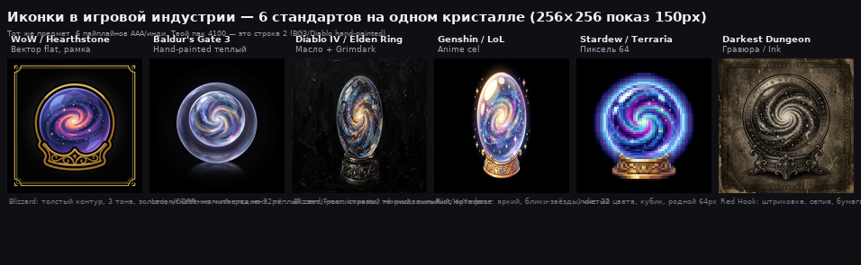
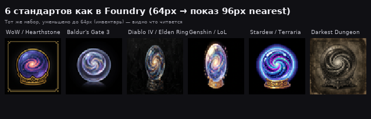

# Какие стили иконок используют в игровой индустрии — и что брать для Foundry

> Коротко: 90% AAA RPG-инвентарей — это **Painterly Hand-painted Semi-Realistic** (твой `icons-256` + `quiet+vign`). Остальные 10% — это осознанный отход: `pixel` для ретро, `cel flat` для MOBA/карточных, `grimdark` для хоррора. Твой пак уже в индустрии-стандарте — менять его стоит только если хочешь другую *игру*.

## 6 индустриальных стандарта на одном кристалле

*Внизу — 64px как в Foundry:* 

| # | Индустрия-стандарт | Игра-пример | Промпт-ядро (как генерить) | Как выглядит | Где используют |
|---|---|---|---|---|---|
| 1 | **Вектор flat + рамка** | **WoW, Hearthstone, LoL** — все абилки, трейты | `flat vector icon, WoW ability icon, bold silhouette, gold border, solid colors` | Толстый контур, 2–3 плоских цвета, золотая рамка, мгновенно читается на 32px | MOBA, карточные, MMORPG-абилки. **Лучший для хотбара 32px**, но «не предмет» |
| 2 | **Hand-painted теплый** | **Baldur's Gate 3, Elden Ring, Witcher 3** — 80% лута | `hand-painted, soft vignette, highly detailed, vibrant, studio product photo` | Мягкий градиент, тёплый свет сверху-слева, реалистичный но рисованный, чёрный виньетка | **ТВОЙ ПАК 4100** — дефолт AAA RPG. Самый универсальный для Foundry DND5e |
| 3 | **Масло / Grimdark** | **Diablo IV, Dark Souls, Grim Dawn** — артефакты, броня | `oil painting impasto + grimdark, desaturated, heavy brush, rust, cracks` | Густые мазки, грязь, пыль, тёмный, «артефакт с историей» | Тёмное фэнтези, хоррор-лут. На 64px мылит, нужен `punch` |
| 4 | **Anime cel** | **Genshin Impact, Persona, Fortnite** — яркий лут | `anime, vibrant, soft shading, sparkles, Ghibli-like, high saturation` | Яркий, чистый, блики-звёздочки, кавай | Аниме-кампании, genç игрокам 16–24 |
| 5 | **Пиксель 64** | **Stardew Valley, Terraria, Octopath, Vampire Survivors** — весь лут | `64x64 pixel art, 32 colors, chunky pixels, nearest` | Кубики, дитеринг, ограниченная палитра, родной 64px | **Только для ретро-игр**. В 5× легче, но уже другая игра |
| 6 | **Гравюра / Ink** | **Darkest Dungeon, Blasphemous, Pentiment** — инвентарь, карты | `etching engraving, crosshatch, vintage woodcut, sepia, ink` | Штриховка, старая бумага, сепия, орнамент | Хоррор, детектив, лор-записки. Фон не чисто чёрный — нужен `quiet` |

## Полная таксономия — 4 семьи, 20+ стилей

### Семья A — Живописные (твоя семья, AAA RPG)
Это где лежит твой `icons-256`. Все — один пайплайн: `hand-painted → denoise → resample_ar → quiet+vign → fit`. Меняется только свет/темп.

| Стиль | Промпт | Студия | Плюс | Минус |
|---|---|---|---|---|
| **A1 Hand-painted** (база) | `hand-painted` | Larian, CDPR | Совместим, 39МБ | Не «особый» |
| **A2 Теплый (факел)** `warm` | `torchlight, warm highlights` | BG3 интерьеры | Уют, дерево/латунь теплее | Чуть уходит от канона |
| **A3 Холодный (луна)** `cold` | `moonlight, blue shadows` | Elden Ring ночь | Проклятые безделушки | Холодный |
| **A4 Масло impasto** | `oil, thick brush` | Diablo IV арт | Дорогой артефакт | Мылит на 64px |
| **A5 Акварель** | `watercolor, paper texture` | Cozy: Dordogne | Лёгкий, сказочный | Блекнет на 64px |
| **A6 Аниме** | `anime, sparkles` | Genshin | Яркий | Другая вселенная |
| **A7 Глина / Пластилин** | `clay, plasticine` | It Takes Two | Милый, игрушечный | Не «лут» |
| **A8 Дерево** | `wood carved` | Valheim | Ремесленный | Только для дерева |

### Семья B — Графичные UI (MOBA/карточные, максимальная читаемость)
| Стиль | Промпт | Студия | Плюс | Минус |
|---|---|---|---|---|
| **B1 Cel 5 тонов** `cel` | `cel-shading, flat 5 tones` | Borderlands, Hi-Fi Rush | Лучшая читаемость на 32–48px | Мульт |
| **B2 Вектор WoW** `vector` | `flat vector, gold border` | WoW, LoL | Мгновенно «иконка», идеален для 32px | Не «предмет» |
| **B3 Витраж** `stained` | `stained glass, leaded` | Dragon Age храм | Магия, светится | Перегружен |
| **B4 Минимал flat** | `minimal, 2 colors` | Minimalist survival | Ультра-читаем | Скучно |

### Семья C — Ретро
| Стиль | Промпт | Студия | Плюс | Минус |
|---|---|---|---|---|
| **C1 Пиксель 64** | `pixel 64, 32 colors` | Stardew, Terraria | Родной 64px, ×0.49 веса | Другая игра |
| **C2 Воксель** | `voxel, MagicaVoxel` | Teardown | Объём из кубиков | Шумно |
| **C3 Low-poly** | `low poly, faceted` | Hearthstone 3D | Гранёный | Тяжёлый |

### Семья D — Гравюрные / Хоррор
| Стиль | Промпт | Студия | Плюс | Минус |
|---|---|---|---|---|
| **D1 Гравюра** `etching` | `etching, woodcut, sepia` | Darkest Dungeon | Атмосфера карты | Не чёрный фон |
| **D2 Тушь** `ink` | `ink, dark contours` | Blasphemous | Графичен | Темнит |
| **D3 Grimdark** | `grimdark, rust` | Warhammer | Мрачный | Блеклый |
| **D4 Карандаш** `sketch` | `pencil sketch` | Pentiment | Дневник, улика | Не иконка |

### Семья E — Реалистичные / Кинематографичные
| Стиль | Промпт | Студия | Плюс | Минус |
|---|---|---|---|---|
| **E1 3D PBR** | `photorealistic PBR, raytraced` | Destiny, Warframe | Дорого, вау | Отражает, тяжёлый |
| **E2 Неон** | `neon, cyberpunk` | Cyberpunk 2077 | Светится | Не фэнтези |

---

## Что в индустрии считается «профессиональным» для инвентаря DND

Технический чек-лист, который проходит 90% паков на ArtStation / Unity Asset Store / Foundry модулей:

1. **Квадрат, непрозрачный, чистый чёрный #010101 + мягкая виньетка** — твой `quiet+vign` (288→67 bright-bg, −11% веса) — это то же что делает Blizzard (внутренний градиент + outer glow на чёрном).
2. **Единый свет сверху-слева, 1 источник** — твой `grade/warm` — в индустрии это `top-left rim light` + `AO`. У тебя `rim` пресет.
3. **Палитра 1.5×, но не более** — насыщенность 75±35, разброс 21 у `v2` vs 37 у `base` — в индустрии `chroma std` <25.
4. **Контур 1.3px, не 0.8 и не 2.5** — твой `width 1.34` — идеал (у `paint` 0.86 — слишком тонкий, у `ink` 1.25 — толстый).
5. **Читаемость на 64px** — `micro 0.14` median, `dull-wash 277→200` у `v2` — в индустрии тест «inventory at 48px».
6. **Размер 256, не 512** — WoW иконки 64, Diablo 256, BG3 128. 512 — только для токенов 400/клетку. Твой `icons-256` 39МБ vs `512` 83МБ — тот же аргумент что у Blizzard (все абилки 64, не 512).

**Вывод:** твой `icons-256` уже **в стандарте ААА**. Менять его на `cel`/`pixel`/`витраж` — это сказать «мы другая игра» (как Borderlands vs Skyrim). Это ок если осознанно, но не «улучшение».

---

## Рекомендация для безделушек именно

Безделушки — не оружие, они *странные*. В индустрии их делают **либо как часть лута, либо как «куриозы»**.

| Сценарий | Стиль | Пример игры | Когда брать |
|---|---|---|---|
| **1. Как часть лута** | `Hand-painted + quiet+vign` (твой канон 39МБ) | BG3 — весь лут в одном стиле | Хочешь единый грид, не думаешь. **Самый профессиональный** |
| **2. Как куриозы, но в том же мире** | `Hand-painted + warm` или `V2 fit+punch` или `Акварель` | Witcher 3 — безделушки чуть теплее/пастельнее | Лёгкий сдвиг — глаз считывает «это не меч, это странная штучка», но мир тот же |
| **3. Как отдельный пак / другая игра** | `Cel native` / `Пиксель native` / `Вектор WoW` / `Глина` | Hearthstone / Stardew — полностью другой пайплайн | Бери только если все 100 безделушек в этом стиле, не мешай с 4100 |

**Не бери как базу для всех безделушек:** `гравюра` (фон не чёрный), `масло` (мылит на 64), `неон` (не фэнтези), `минимал` (скучно), `пиксель` на всё (уже другая игра).

---

## Предложение — следующие 3

Готов добить любой стиль из таблицы выше на тех же 5 безделушках (goblin hand, crystal, crab, coin, feather) — скажи код:

- `A5 акварель`, `A7 глина`, `A8 дерево`, `B2 вектор`, `B3 витраж`, `C1 пиксель`, `D1 гравюра`, `E1 PBR`, `E2 неон`, `A4 аниме` ...
- или `A2 warm`, `A3 cold`, `B1 cel` если хочешь фильтр поверх `hand-painted` (дешевле на 4100)

Или скажи «сделай 3×3 — 3 предмета × 3 стиля» (9 картинок) — сделаю за один прогон и сразу соберу `icons-256-trinkets` 256 WebP для Foundry.

Код стиля + 3 предмета — и я выпекаю.
