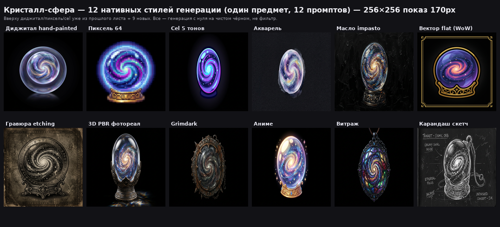
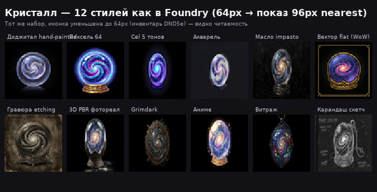

# Ещё стили — полное меню для безделушек (и всего лута)

> **Зачем 12+ стилей на одном кристалле:** чтобы ты увидел *характер* каждого промпта, а не случайность. Все 12 — генерация **с нуля** на чистом чёрном (не фильтр поверх `hand-painted`), размер 256×256, виньетка. Монтаж — `more-styles-crystal.png` (170px) и `more-styles-crystal-64.png` (64→96 как в Foundry).

## Быстрый просмотр (1 предмет — кристалл-сфера)

*64px в игре:* 

---

## Полное меню — 20 стилей, разбитых по семьям

### A. Живописные (тёплые, ручные) — лучше всего для безделушек, если хочешь «сказку»
| # | Стиль | Промпт-ядро | Как выглядит на безделушке | Плюс | Минус | Когда брать |
|---|---|---|---|---|---|---|
| A1 | **Диджитал hand-painted** *(твой канон 4100, base 8)* | `hand-painted, soft vignette, highly detailed, vibrant` | Как сейчас — сочный, полуреалистичный, мягкий градиент | Совместим с 4100, читается на 64px | Не «особый» | **Дефолт если безделушки — часть общего лута** |
| A2 | **Акварель** | `watercolor, paper texture, soft washes, bleeding edges` | Полупрозрачный кристалл, бумага, лёгкий, пастель | Лёгкий, сказочный, не спорит с тёмным фоном | Блекнет на 64px (пастель) | Уютная кампания, fairy-tale, добрые безделушки |
| A3 | **Масло impasto** | `oil painting, thick impasto, baroque, heavy brush` | Кристалл как в музее — густые мазки, тёмный фон вообще чёрная жижа | Статус «артефакт», богатый | Тяжёлый, мылит на 64px (мазки сливаются) | Тёмное фэнтези, реликвии, музей |
| A4 | **Аниме** | `anime, vibrant, soft shading, sparkles, Ghibli-like` | Тот же кристалл но «аниме-сфера» — яркий, с бликами-звёздочками | Очень читаем, нравится игрокам 18–25 | Уходит от твоего пака (другая вселенная) | Аниме-кампания, кавай-безделушки |
| A5 | **Карандаш скетч** | `pencil sketch, graphite, crosshatching, concept art` | Кристалл как набросок — белые линии на чёрном, надписи | Атмосфера «записки исследователя», дёшево | Не «иконка предмета», а набросок | Дневник, квест-предмет, улика |

### B. Графичные UI — самые читаемые на 64px
| # | Стиль | Промпт-ядро | Как выглядит | Плюс | Минус | Когда брать |
|---|---|---|---|---|---|---|
| B1 | **Cel 5 тонов (native)** | `cel-shading, flat colors, 5 crisp tones, thick outline` | Кристалл — 5 плоских заливок, контур | **Лучшая читаемость на 64px** после пикселя | Мульт, не реалистичен | Toon / Borderlands-кампания, детские |
| B2 | **Вектор flat WoW** | `flat vector icon, WoW ability icon, bold silhouette, gold border` | Кристалл в золотой рамке как абилка WoW — графично, толстый силуэт | Мгновенно «это иконка», идеален для хотбара | Слишком UI, теряется «предметность» | Если безделушки — как абилки/фиты |
| B3 | **Витраж** | `stained glass, leaded glass, mosaic, jewel tones` | Кристалл-подвеска витраж — чёрный кант, цветные стекла | Очень «магический», светится | Перегружен для маленького размера | Храмовые / фейские безделушки |

### C. Ретро
| # | Стиль | Промпт-ядро | Как выглядит | Плюс | Минус | Когда брать |
|---|---|---|---|---|---|---|
| C1 | **Пиксель 64 (native)** | `64x64 pixel art, 32 colors, chunky pixels, nearest` | Пиксель-кристалл на подставке, кубики | **Идеален на 64px (родной)**, в 5× легче | Отдельная игра | Ретро / 8-bit кампания, олдскул |
| C2 | **Voxel / 3D-кубики** *(не показан, могу сгенерить)* | `voxel art, MagicaVoxel, blocky 3D` | Кубический кристалл | Объём из кубиков | Шумно на чёрном | Если уже есть воксель-паки |

### D. Гравюрные / винтаж
| # | Стиль | Промпт-ядро | Как выглядит | Плюс | Минус | Когда брать |
|---|---|---|---|---|---|---|
| D1 | **Гравюра etching** | `etching engraving, crosshatch, vintage woodcut, sepia` | Кристалл на старой бумаге с орнаментом — весь лист как гравюра | Атмосфера «древней карты», уникально | Фон не чисто чёрный — придётся `quiet` | Проклятые / древние безделушки, лор |
| D2 | **Ink тушь** *(есть как фильтр, но можно и native)* | `ink outline, dark contours, pen` | Тёмные контуры, как в комиксе | Графичен | Темнит, теряет цвет | Готика |

### E. Реалистичные / кинематографичные
| # | Стиль | Промпт-ядро | Как выглядит | Плюс | Минус | Когда брать |
|---|---|---|---|---|---|---|
| E1 | **3D PBR фотореал** | `photorealistic 3D PBR, raytraced, subsurface scattering, glass` | Кристалл-капсула как из рендера — реалистичное стекло, каустика | Вау-эффект, «дорого» | Тяжёлый, отражает чёрный фон, может ослепить в гриде | Хай-тек магия, артефакты уровня AAA |
| E2 | **Grimdark** | `grimdark, desaturated, gritty, rust, Warhammer` | Кристалл грязный, потёртый, шипастая рамка | Мрачный, подходит cursed trinkets | Блеклый, плохо выделяется | Тёмная кампания, проклятия |
| E3 | **Живопись Kuwahara (фильтр)** | `paint, Kuwahara facets` | Как масло но фасетками, не мазками | Уже есть как фильтр — дёшево | Мылит на 64px | Альтернатива маслу если лень генерить |

---

## Фильтры vs Натив — в чём разница

- **Натив (promпт с нуля):** модель рисует сразу в этом стиле. Пиксель — настоящий кубик 32 цвета, cel — настоящий плоский цвет с контуром, акварель — с бумагой. **Аутентично**, но на каждый стиль надо генерить заново 100 / 4100 штук (дороже, дольше, разброс сидов).
- **Фильтр (`tools/stylize.py`):** берём твой `hand-painted` и перекрашиваем numpy: `cel` = сгладил + 5 тонов, `pixel` = 64px+квант 32, `paint` = фасетки, `warm/cold` = температура. **Дешёво и консистентно** — 4100 за минуту, один сид. Но пиксель через фильтр — это «размытый диджитал в кубиках», не настоящий пиксель.

Для безделушек **рекомендую натив если стиль — смена техники** (пиксель, cel, акварель, вектор), и **фильтр если стиль — свет/темп** (warm, cold, quiet+vign).

---

## Что выбрать для безделушек — 3 сценария

**Сценарий 1 — Безделушки как часть лута (рекомендован):**
`Диджитал hand-painted + quiet+vign` — те же 4100, просто +3 безделушки. Единый грид, ничего не спорит. Самый дешёвый.

**Сценарий 2 — Безделушки должны чувствоваться «особенными» но в том же мире:**
Оставь 4100 на `quiet+vign`, а 100 безделушек на `warm` или `V2 (fit+punch)` или `акварель` — лёгкий сдвиг, глаз считывает «это не оружие, это странная штучка».

**Сценарий 3 — Безделушки — отдельный пак / другая игра:**
`cel native` (мульт), `pixel native` (ретро), `вектор WoW` (UI) — три полностью разных мира. Выбери один и держи все 100 в нём. Не мешай их.

---

## Что могу сразу сгенерить (ты сказал «на 3 пока остановимся»)

Готов доделать **3 финальные безделушки 256×256 WebP** в любом из 12 нативных стилей выше — скажи:

1. Какие 3 предмета (из 8: goblin hand, crystal orb, crab, coin, feather, maze orb, rag doll, music box — или свои 3 идеи)
2. Какой 1 стиль (например `акварель`, `вектор flat`, `grimdark`, или `pixel`)

Или хочешь **сетку 3×3** — 3 предмета × 3 стиля (9 картинок) чтобы выбрать финал — тоже сделаю за один прогон.

Также могу показать ещё 2-3 стиля на других предметах (не только кристалл) — например `акварель/вектор/grimdark` на крабе/перьях/кукле — чтобы убедиться что стиль универсален.

Скажи номер: `A1`..`E3` выше, и какие 3 безделушки.
